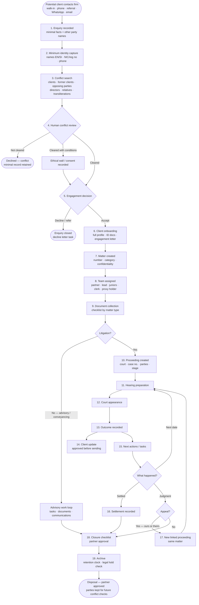
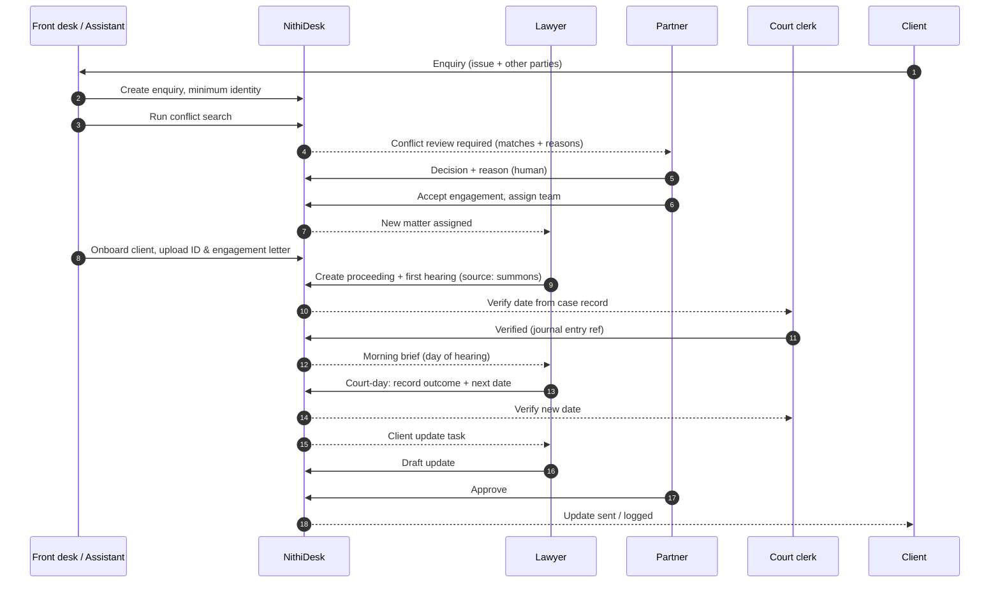

# Diagram — Client Journey

## 1. End-to-end journey with decision points

```mermaid
flowchart TD
    A([Potential client contacts firm<br/>walk-in · phone · referral · WhatsApp · email]) --> B[1. Enquiry recorded<br/>minimal facts + other party names]
    B --> C[2. Minimum identity capture<br/>names EN/SI · NIC/reg no · phone]
    C --> D[3. Conflict search<br/>clients · former clients · opposing parties<br/>directors · relatives · transliterations]
    D --> E{4. Human conflict review}
    E -->|Not cleared| X1([Declined — conflict<br/>minimal record retained])
    E -->|Cleared with conditions| W[Ethical wall / consent recorded]
    E -->|Cleared| F
    W --> F{5. Engagement decision}
    F -->|Decline / refer| X2([Enquiry closed<br/>decline letter task])
    F -->|Accept| G[6. Client onboarding<br/>full profile · ID docs · engagement letter]
    G --> H[7. Matter created<br/>number · category · confidentiality]
    H --> I[8. Team assigned<br/>partner · lead · juniors · clerk · proxy holder]
    I --> J[9. Document collection<br/>checklist by matter type]
    J --> K{Litigation?}
    K -->|No — advisory / conveyancing| ADV[Advisory work loop<br/>tasks · documents · communications]
    K -->|Yes| L[10. Proceeding created<br/>court · case no. · parties · stage]
    L --> M[11. Hearing preparation]
    M --> N[12. Court appearance]
    N --> O[13. Outcome recorded]
    O --> P[14. Client update<br/>approved before sending]
    O --> Q[15. Next actions / tasks]
    Q --> R{What happened?}
    R -->|Next date| M
    R -->|Settled| S[16. Settlement recorded]
    R -->|Judgment| T{Appeal?}
    T -->|Yes — ours or theirs| U[17. New linked proceeding<br/>same matter]
    U --> M
    T -->|No| V
    S --> V[18. Closure checklist<br/>partner approval]
    ADV --> V
    V --> Y[19. Archive<br/>retention clock · legal hold check]
    Y --> Z([Disposal — partner approved<br/>parties kept for future conflict checks])
```

## 2. Swimlane view — who does what

```mermaid
sequenceDiagram
    autonumber
    participant FD as Front desk / Assistant
    participant SYS as NithiDesk
    participant LW as Lawyer
    participant PT as Partner
    participant CK as Court clerk
    participant CL as Client

    CL->>FD: Enquiry (issue + other parties)
    FD->>SYS: Create enquiry, minimum identity
    FD->>SYS: Run conflict search
    SYS-->>PT: Conflict review required (matches + reasons)
    PT->>SYS: Decision + reason (human)
    PT->>SYS: Accept engagement, assign team
    SYS-->>LW: New matter assigned
    FD->>SYS: Onboard client, upload ID & engagement letter
    LW->>SYS: Create proceeding + first hearing (source: summons)
    SYS-->>CK: Verify date from case record
    CK->>SYS: Verified (journal entry ref)
    SYS-->>LW: Morning brief (day of hearing)
    LW->>SYS: Court-day: record outcome + next date
    SYS-->>CK: Verify new date
    SYS-->>LW: Client update task
    LW->>SYS: Draft update
    PT->>SYS: Approve
    SYS-->>CL: Update sent / logged
```
